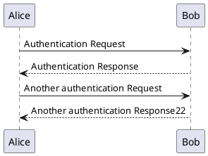
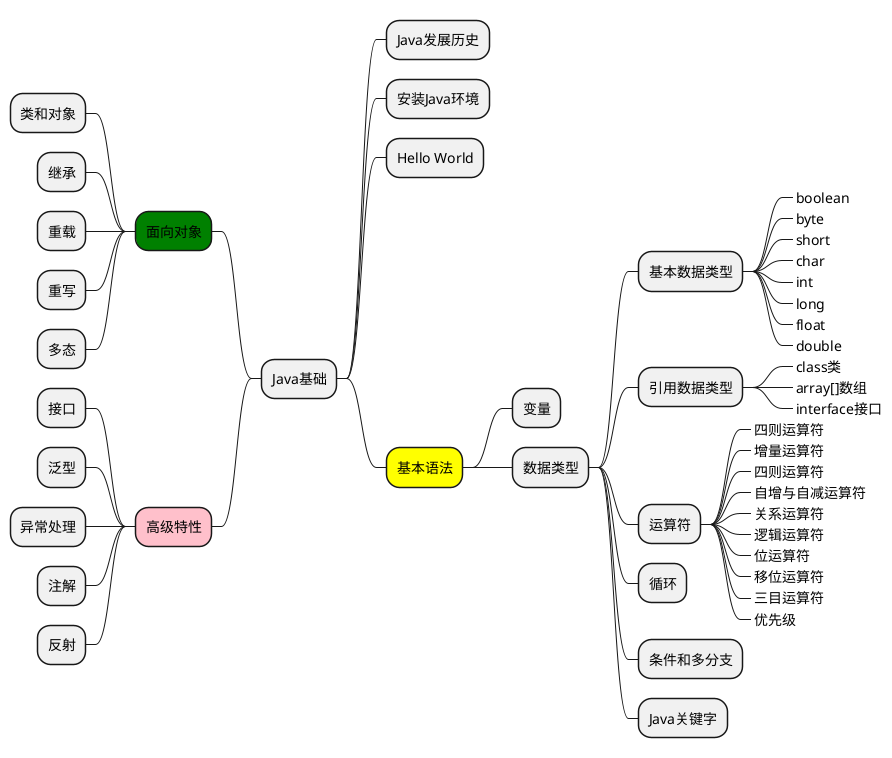

1. docsify的模板工程
2. 集成了各种插件

## 任务列表
* [x] 123
* [ ] xxx

## tab示例
<!-- tabs:start -->
#### **English**
Hello!
#### **French**
Bonjour!
<!-- tabs:end -->

## alerts示例
> [!TIP]
> An alert of type 'tip' using global style 'callout'.

> [!NOTE]
> An alert of type 'note' using global style 'callout'.

> [!WARNING]
> An alert of type 'warning' using global style 'callout'.

> [!ATTENTION]
> An alert of type 'attention' using global style 'callout'.

## plantuml示例

## B站视频示例
<iframe style="width:100%;min-height:550px;" src="//player.bilibili.com/player.html?aid=308890282&bvid=BV1RA411z79H&cid=994986594&page=1" scrolling="no" border="0" frameborder="no" framespacing="0" allowfullscreen="true"> </iframe>
