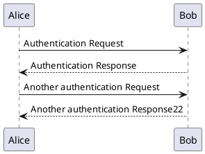
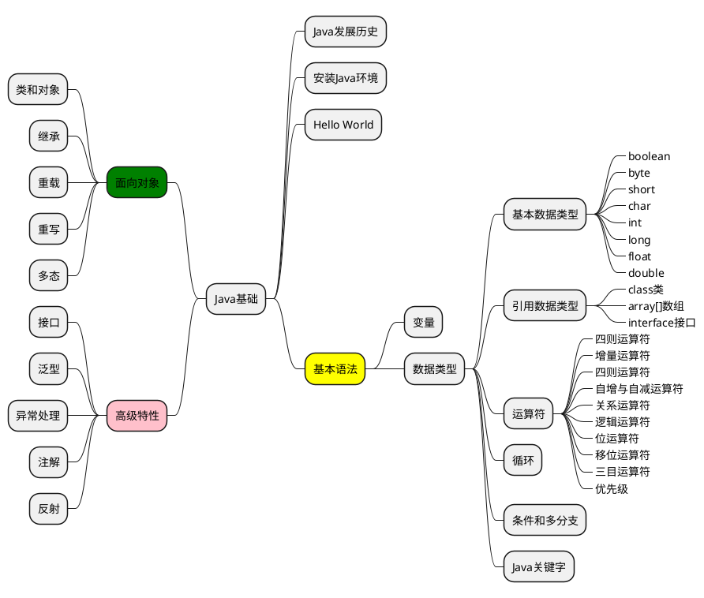

> 整理各种语法支持，和插件内容格式，以demo示例形式供查阅！

## markdown语法
[markdown语法详细请参考](https://www.appinn.com/markdown/)

## 任务列表
``` md
* [x] 任务1
* [ ] 任务2
```
效果如下
* [x] 任务1
* [ ] 任务2

## tab示例
依赖插件：[docsify-tabs](https://www.npmjs.com/package/docsify-tabs)
``` md
<!-- tabs:start -->
#### **English**
Hello!
#### **French**
Bonjour!
<!-- tabs:end -->
```
效果如下：

<!-- tabs:start -->
#### **English**
Hello!
#### **French**
Bonjour!
<!-- tabs:end -->

## flexible-alerts示例
依赖插件：[docsify-plugin-flexible-alerts](https://www.npmjs.com/package/docsify-plugin-flexible-alerts)
``` md
> [!TIP]
> An alert of type 'tip' using global style 'callout'.

> [!NOTE]
> An alert of type 'note' using global style 'callout'.

> [!WARNING]
> An alert of type 'warning' using global style 'callout'.

> [!ATTENTION]
> An alert of type 'attention' using global style 'callout'.
```
效果如下：
> [!TIP]
> An alert of type 'tip' using global style 'callout'.

> [!NOTE]
> An alert of type 'note' using global style 'callout'.

> [!WARNING]
> An alert of type 'warning' using global style 'callout'.

> [!ATTENTION]
> An alert of type 'attention' using global style 'callout'.


## plantuml示例
依赖插件：[docsify-plantuml](https://www.npmjs.com/package/docsify-plantuml)
### 顺序图
``` md
@startuml
Alice -> Bob: Authentication Request
Bob --> Alice: Authentication Response

Alice -> Bob: Another authentication Request
Alice <-- Bob: Another authentication Response22
@enduml
```
效果如下：

### 思维导图
``` md
@startmindmap
* Java基础
** Java发展历史
** 安装Java环境
** Hello World
**[#yellow] 基本语法
*** 变量
*** 数据类型
**** 基本数据类型
*****_ boolean
*****_ byte
*****_ short
*****_ char
*****_ int
*****_ long
*****_ float
*****_ double
**** 引用数据类型
*****_ class类
*****_ array[]数组
*****_ interface接口
**** 运算符
*****_ 四则运算符
*****_ 增量运算符
*****_ 四则运算符
*****_ 自增与自减运算符
*****_ 关系运算符
*****_ 逻辑运算符
*****_ 位运算符
*****_ 移位运算符
*****_ 三目运算符
*****_ 优先级
**** 循环
**** 条件和多分支
**** Java关键字
--[#green] 面向对象
--- 类和对象
--- 继承
--- 重载
--- 重写
--- 多态
--[#pink] 高级特性
--- 接口
--- 泛型
--- 异常处理
--- 注解
--- 反射
@endmindmap
```
效果如下：


## B站视频示例
去B站视频播放页，先点击分享后点击嵌入代码，获取如下源码：
```html preview
<iframe style="min-width:800px;min-height:550px;" src="//player.bilibili.com/player.html?aid=480251272&bvid=BV1UT411272V&cid=964518458&page=1" scrolling="no" border="0" frameborder="no" framespacing="0" allowfullscreen="true"> </iframe>
```


## html预览示例
```html preview
<p>Hello, World.</p>
```
